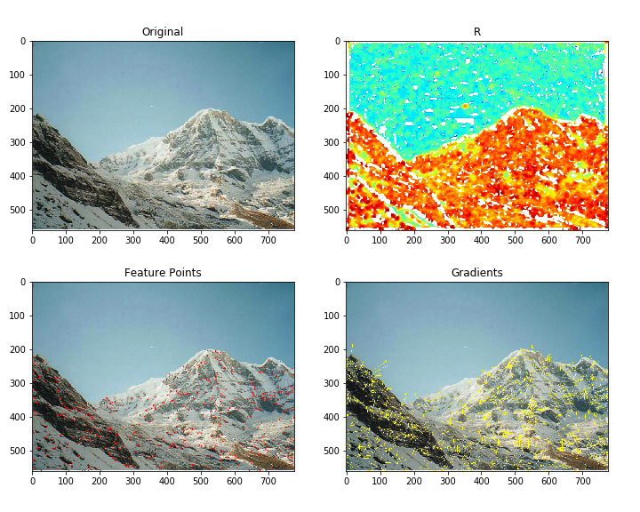
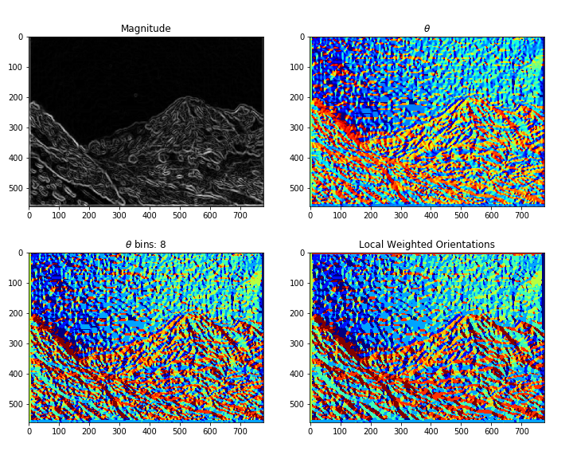
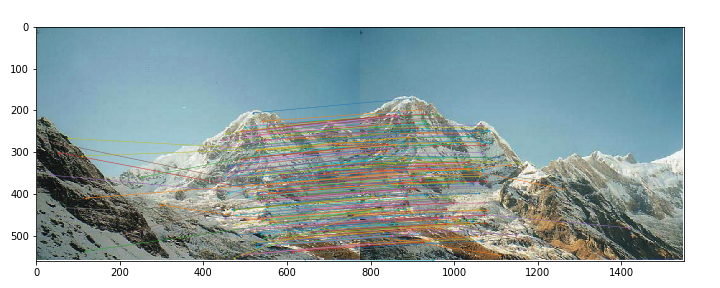
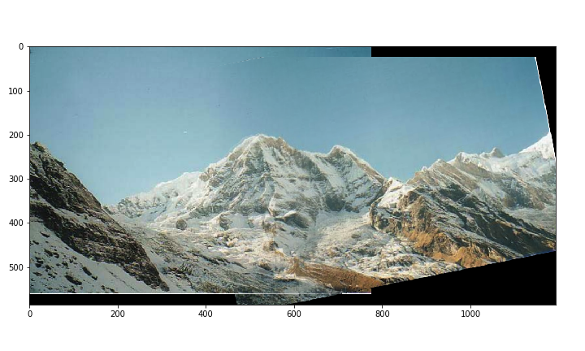

# VFX Project 2 - Image Stitching

## 0. Team Members

* 網媒碩一 r07944007 林良翰
* 資工碩一 r07922100 楊力權

 ## 1. Prerequisites

###  1.1. Camera

* Nikon D5100  &  NIKON AF-S DX NIKKOR 16-85mm f/3.5-5.6G ED VR

 ###  1.2. Environment

* macOS Sierra 10.12.6
* Python ~= 3.6.2
  * matplotlib ~= 2.0.2
  * numpy >= 1.13.1
  * opencv-python ~= 3.3.0.10
  * pandas ~= 0.21.1
  * scipy >= 0.19.1

## 2. Code Works

###  2.1. Cyliner Warping

* 首先把影像投影到圓柱座標上，讓之後的image matching只有平移(translation)的關係，方便進行操作。
* 我們先用AutoStitch軟體得到每張影像大致的focal length，接著參考投影片中的圓柱座標公式，使用inverse warping求出對應的影像為何。

### 2.2. Feature Detection

* 利用課堂中所教授的Harris Corner Detection方法來完成Feature Detection。
* 首先替所有點(pixel)計算其一次微分 $I_x, I_y$ 與二次微分 $I_x^2, I_y^2$，並使用Gaussian filter處理，然後求出corner response $R$，接著設定門檻值(threshold)，過濾掉corner response低於門檻值的點，然後對feature candidates計算出local maximum (以corner response當比較數值)，剩下的點即為求得的特徵點。

 ###  2.3. Feature Descriptor

* 前一步驟找完特徵點後我們必須能有個描述特徵點的方法，才能在不同影像中找尋相似的特徵點，
* 我們使用的為SIFT的descriptor (local descriptor)，找出每一個點的方向(Orientations)。
* 首先對每個特徵點套上一個window，計算該window內特徵點的主要方向(gradient方向)為何，接著對特徵點套用一個16x16的window並根據前一步求出的主要方向旋轉，對旋轉完後的window所覆蓋的點計算local descriptor (4x4x8 = 128 維的向量)，而使用local descriptor的用意是為了讓特徵點能不受到旋轉(rotation)影響。

###  2.4. Feature Matching

* Feature matching是要找尋兩張影像中特徵點的對應關係，我們是直接利用爆搜法找出不同影像中特徵點向量間距離最小的作為一個對應關係(matching) (並且要求最近的距離必須和第二近的距離有一定比例上的差距才認定為正確的對應)

###  2.5. Image Matching

* 利用前一步驟求出的feature matching，計算出影像間需要進行多少的平移就可以將影像拼接在一起了，為了減少feature mismatching造成的誤差，我們利用了RANSAC的技巧。
* 每回合我們採樣4組兩張圖片相對應的特徵點 (最小能產生translation的sample)，並假設feature matching的正確率 $p$ 和希望達成的正確率 $P$，即可利用RANSAC求出至少應進行的回合數 $k$。其餘特徵點套上採樣的特徵點算出的位移關係 $dx, dy$ 後，檢查他們的位置是否互相對應，並計算正確對應的個數。最後找出正確個數最多的平移關係當作兩張圖片之間的平移對應關係。

###  2.6. Image Blending

* 前一步奏計算出使影像拼接在一起的平移關係後，必須對重疊的部分做處理，我們使用的方法為linear blending，也就是重疊區域的像素越靠近哪張影像，該影像像素的比重就會越大，反之亦然。如此我們便可以得到一張平滑全景影像(panorama)了。

###  2.7. Bundle Adjustment

* 當合成完全景圖之後，由於每張圖片彼此的最佳對應位置會上下飄動(drifting)，導致第一張和最後一張的高度位置有所落差。
* 我們利用cv2套件的perspective warping來校正首尾兩張圖片的高度關係。

## 3. Implementation

###  3.1. Parameters

* | Stage              | Variable                    | Type    | Value           |
  | ------------------ | --------------------------- | ------- | --------------- |
  | Read Images        | resize height `fix_h`       | `int`   | 480             |
  | Cylinder Warping   | focal length `focal`        | `float` | from AutoStitch |
  | Feature Detection  | Gaussian filter `r_ksize`   | `int`   | 9 $\times$ 9    |
  |                    | Gaussian filter sigma `r_s` | `float` | 3               |
  |                    | coefficient `r_k`           | `float` | 0.04            |
  |                    | threshold `r_thres`         | `float` | 0.5             |
  | Feature Descriptor | angle sectors `o_bins`      | `int`   | 8               |
  |                    | orientation blur `o_ksize`  | `int`   | 9 $\times$ 9    |
  | Feature Matching   | threshold `m_thres`         | `float` | 0.8             |
  | Image Matching     | number of samples `m_n`     | `int`   | 4               |
  |                    | iterations `m_K`            | `int`   | 1000            |
  | Image Blending     | -                           | -       | -               |
  | Bundle Adjustment  | -                           | -       | -               |

###  3.2. Usage

* Input directory content
  * `*.[jpg | png | gif]` : input images.
  * `pano.txt` : focal length of images generated from AutoStitch.
* Program usage
  * Run : `python image_stitching.py <input_dir>`
  * Help message: `python image_stitching.py -h`

###  3.3. Results

####   Parrington

* 
* 18 images
* focal length ≈ 705

#### Beach Hotel

- 
- 15 images
- focal length ≈ 970

####    NTU Lake (our photo)

* 
* 10 images
* focal length ≈ 525

#### NTU Library (our photo)

- 
- 20 images
- focal length ≈ 670

## 4. Other Code Works

###   4.1. Visualize Features

* `plot.py`

  |       Function        |              Visualization              |
  | :-------------------: | :-------------------------------------: |
  |   `plot_features()`   |          |
  | `plot_orientations()` |  |
  |   `plot_matches()`    |            |

###  4.2. Image Matching & Blending with Rotations

* `other_utils.py`
  * `ransac_with_rotation()`
  * `blend_with_rotation()`
    

### 4.3. Simple Image Blending

- `other_utils.py`
  - `blend()`

### 
